# Lab8Web

Nama  : Bangkit Akbar Anggara 
NIM   : 312010148 
Kelas : TI.20.B.1 

### Tugas
Berikut adalah tugas untuk praktikum 8 pertemuan 10 
 

### Pengerjaan
1. Pertama - tama buka dulu xampp control 
 
2. Lalu selanjutnya buka localhost/phpmyadmin 
3. Selanjutnya kita buat latihan1 
4. Setelah itu kita buat database data_barang seperti dibawah ini 
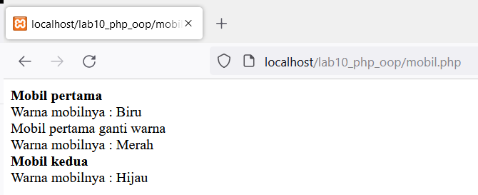 
5. Setelah membuat database selanjutnya kita buat data barangnya seperti dibawah ini 
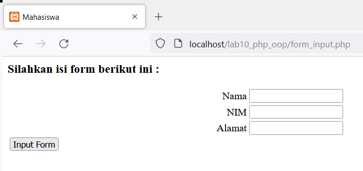 
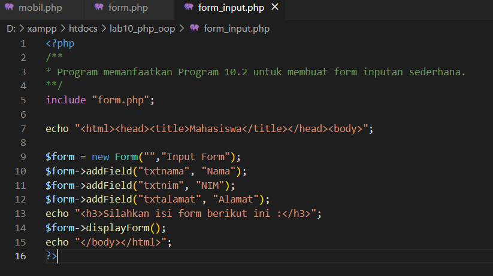 
6. Selanjutnya kita buat folder lab8_php_database 
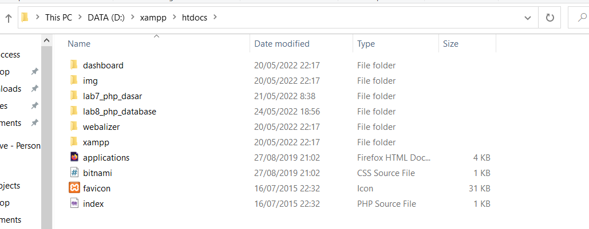 
7. Setelah itu kita buat koneksi.php nya seperti dibawah ini 
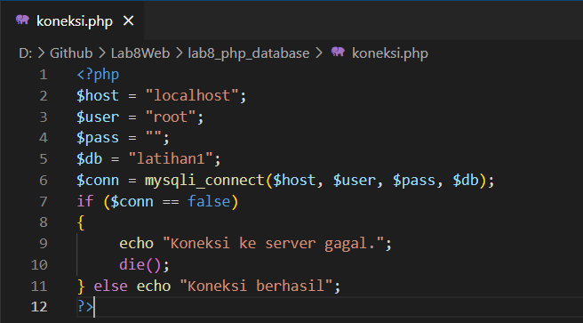 
Jika berhasil maka tampilannya akan seperti berikut ini 
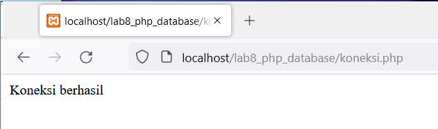 
8. Setelah kita buat koneksinya selanjutnya kita buat index.php kalian bisa klik disamping untuk melihat codingannya:[Click Here](lab8_php_database/index.php) 
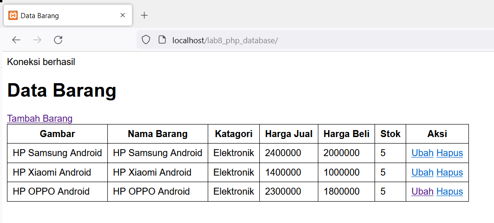 
9. Setelah itu kita buat tambah.php untuk menambah data di index tadi kalian bisa klik disamping untuk melihat codingannya:[Click Here](lab8_php_database/tambah.php) 
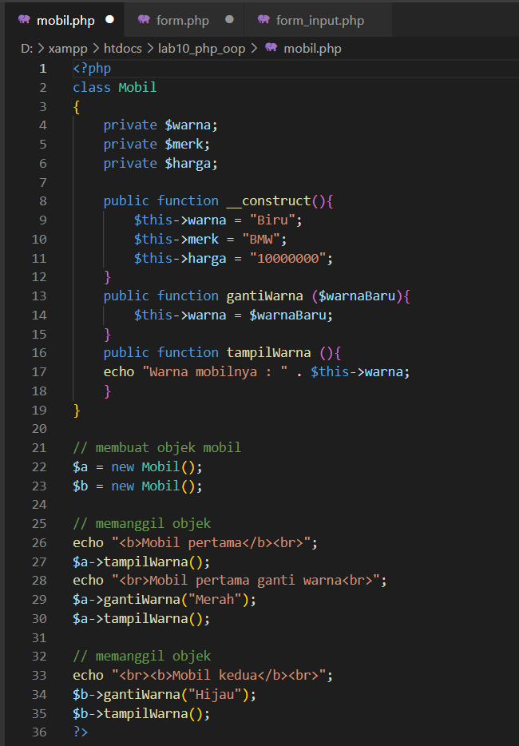 
Maka hasilnya akan seperti berikut 
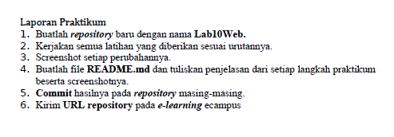 
10. Setelah itu selanjutnya kita buat ubah.php untuk mengubah data index kalian bisa klik disamping untuk melihat codingannya:[Click Here](lab8_php_database/ubah.php) 
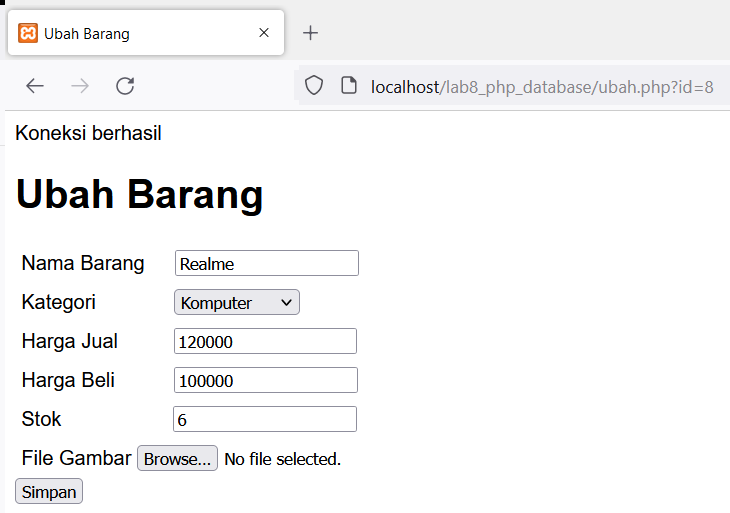 
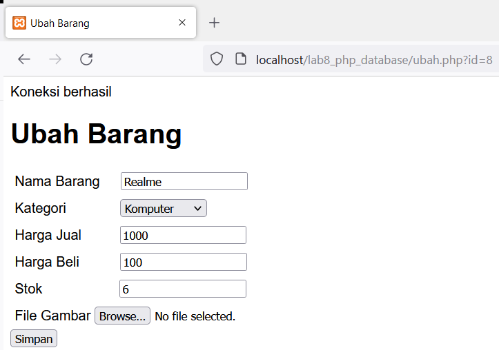 
Maka hasilnya akan seperti berikut ini 
 
11. Terakhir kita buat hapus.php untuk menghapus data didalam index seperti berikut 
 
Maka hasilnya akan seperti berikut data Realme hilang 
 

Sekian dari saya 
Terimakasih banyak sudah membaca 

#### By: Bangkit Akbar Anggara - 312010148 - TI.20.B.1
