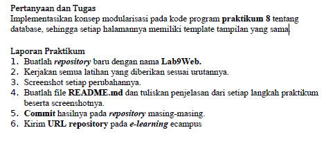
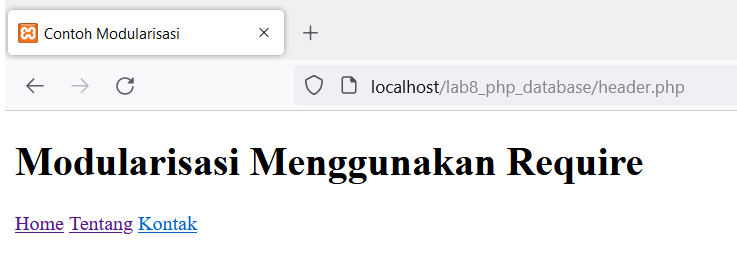
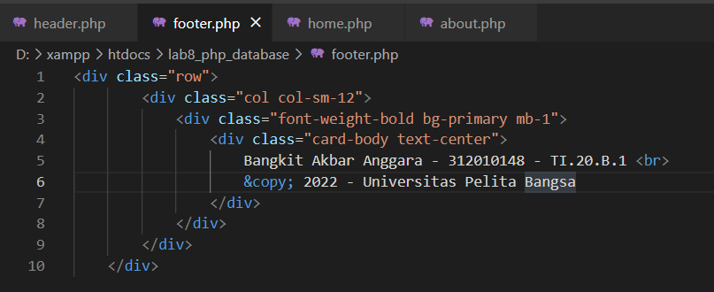
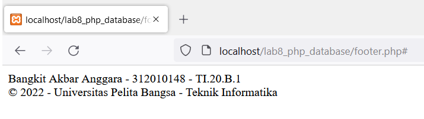
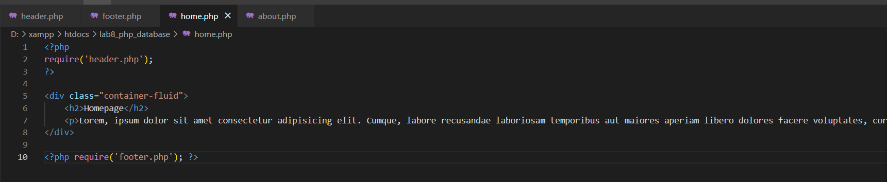
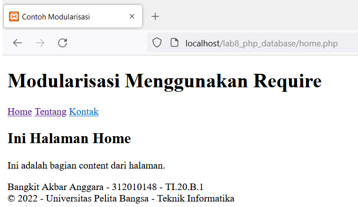
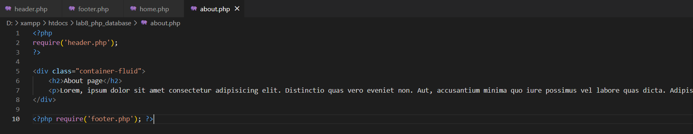
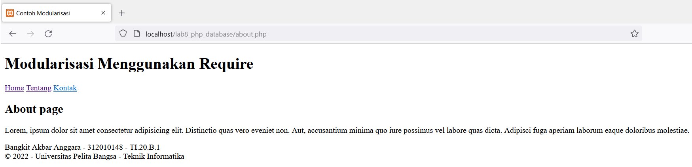
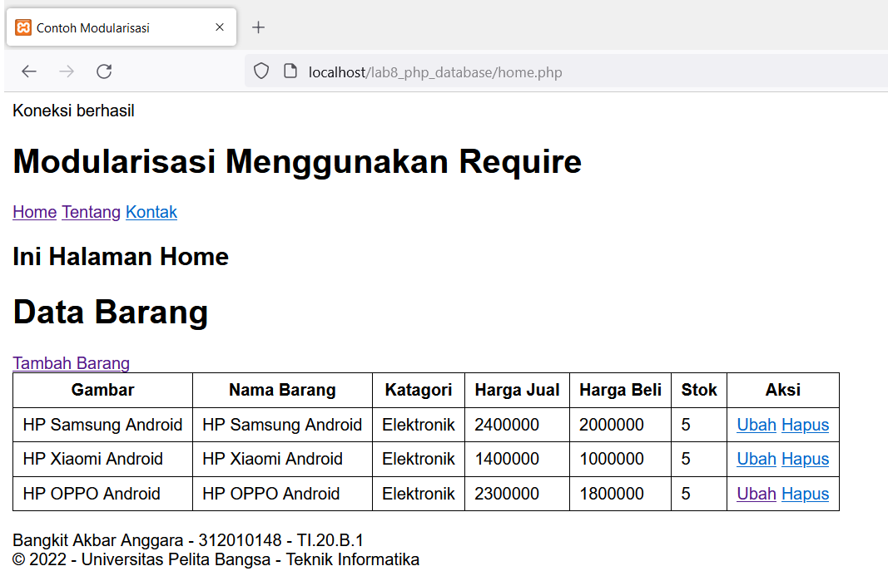

# Lab9Web

Nama  : Bangkit Akbar Anggara 
NIM   : 312010148 
Kelas : TI.20.B.1 

### Tugas
Berikut adalah tugas untuk praktikum 9 pertemuan 11 
 

### Pengerjaan
1. Seperti biasa kalian buka dahulu xampp controlnya 
2. Selanjutnya buat file header.php kalian bisa klik di samping untuk melihat syntaxnya : [Click Here](lab9_php_modular/header.php) 
Berikut adalah tampilannya 
 
3. Selanjutnya kita buat juga file footer.php seperti berikut 
 
Berikut tampilannya 
 
4. Selanjutnya kita buat juga home.php seperti berikut 
 
Berikut adalah tampilannya 
 
5. Selanjutnya kita buat juga about.php seperti berikut 
 
Berikut tampilannya 
 

### Jawaban
Berikut tampilan setelah diimplementasikan ke pada lab8_php_database 
 

Sekian dari saya 
Terimakasih banyak sudah membaca 

#### By: Bangkit Akbar Anggara - 312010148 - TI.20.B.1
